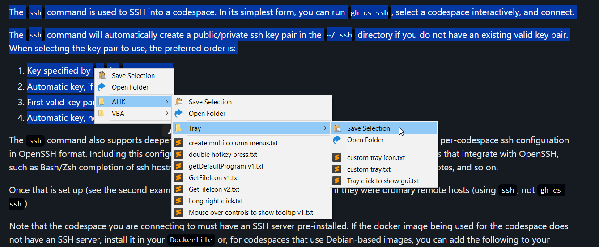
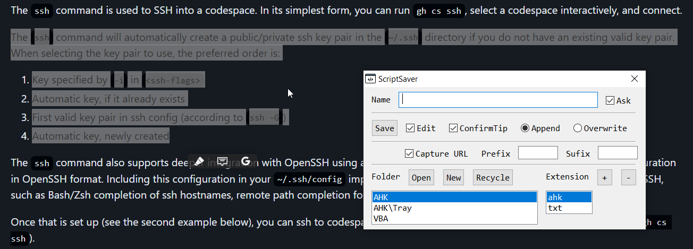

# Snipper

* 2x CTRL to show menu (loads snippet folder structure, shows only txts)  
* Save selected text to any folder
  (you will be asked for filename in the format of FILENAME.EXTENSION  
  appends to it so if file exists the previous content won't be lost.  
  the extension can be of your choosing but as this is intended to handle snippets, only txts will be loaded in menu)
* Click a file to paste its content
* CTRL & click to edit file
* SHIFT & click to append selection to file

---

# Script Saver

This is the first version, it can save the url or program name from where the selection was saved.
Saves/Loads user selections and gui position automatically 
  

